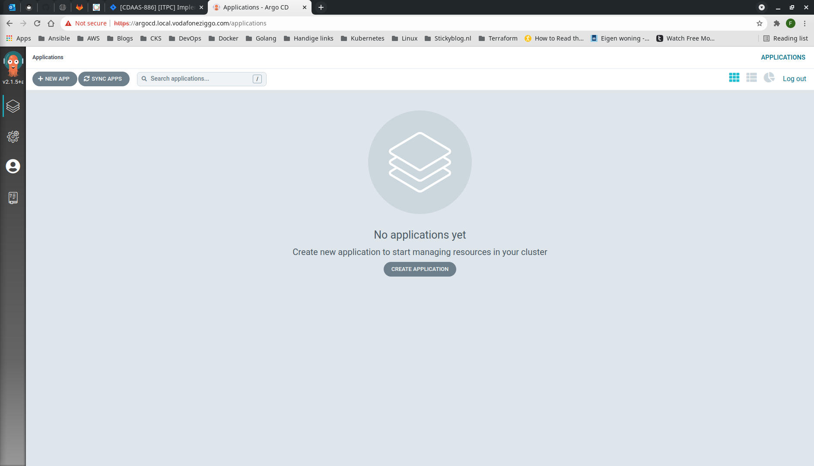

# ARGOCD
This document describes how to provision ArgoCD on a Vagrant Kubernetes cluster following the [official documentation](https://argo-cd.readthedocs.io/en/stable/getting_started/).
## Step-by-step
1. SSH into the master node and check cluster availability.
```bash
$ vagrant ssh k8s-m-1
Welcome to Ubuntu 20.04.2 LTS (GNU/Linux 5.4.0-80-generic x86_64)

 * Documentation:  https://help.ubuntu.com
 * Management:     https://landscape.canonical.com
 * Support:        https://ubuntu.com/advantage

  System information as of Tue 26 Oct 2021 05:42:08 PM UTC

  System load:  0.95              Users logged in:        0
  Usage of /:   6.5% of 61.31GB   IPv4 address for eth0:  10.0.2.15
  Memory usage: 43%               IPv4 address for eth1:  192.168.50.11
  Swap usage:   0%                IPv4 address for tunl0: 192.168.116.0
  Processes:    161


This system is built by the Bento project by Chef Software
More information can be found at https://github.com/chef/bento
Last login: Tue Oct 26 17:39:01 2021 from 10.0.2.2
```
2. Create argocd ```namespace```.
```bash
vagrant@k8s-m-1:~$ kubectl create namespace argocd
namespace/argocd created
```
3. Deploy ArgoCD.
```bash
vagrant@k8s-m-1:~$ kubectl apply -n argocd -f https://raw.githubusercontent.com/argoproj/argo-cd/stable/manifests/install.yaml
customresourcedefinition.apiextensions.k8s.io/applications.argoproj.io created
customresourcedefinition.apiextensions.k8s.io/appprojects.argoproj.io created
serviceaccount/argocd-application-controller created
serviceaccount/argocd-dex-server created
serviceaccount/argocd-redis created
serviceaccount/argocd-server created
role.rbac.authorization.k8s.io/argocd-application-controller created
role.rbac.authorization.k8s.io/argocd-dex-server created
role.rbac.authorization.k8s.io/argocd-server created
clusterrole.rbac.authorization.k8s.io/argocd-application-controller created
clusterrole.rbac.authorization.k8s.io/argocd-server created
rolebinding.rbac.authorization.k8s.io/argocd-application-controller created
rolebinding.rbac.authorization.k8s.io/argocd-dex-server created
rolebinding.rbac.authorization.k8s.io/argocd-redis created
rolebinding.rbac.authorization.k8s.io/argocd-server created
clusterrolebinding.rbac.authorization.k8s.io/argocd-application-controller created
clusterrolebinding.rbac.authorization.k8s.io/argocd-server created
configmap/argocd-cm created
configmap/argocd-cmd-params-cm created
configmap/argocd-gpg-keys-cm created
configmap/argocd-rbac-cm created
configmap/argocd-ssh-known-hosts-cm created
configmap/argocd-tls-certs-cm created
secret/argocd-secret created
service/argocd-dex-server created
service/argocd-metrics created
service/argocd-redis created
service/argocd-repo-server created
service/argocd-server created
service/argocd-server-metrics created
deployment.apps/argocd-dex-server created
deployment.apps/argocd-redis created
deployment.apps/argocd-repo-server created
deployment.apps/argocd-server created
statefulset.apps/argocd-application-controller created
networkpolicy.networking.k8s.io/argocd-application-controller-network-policy created
networkpolicy.networking.k8s.io/argocd-dex-server-network-policy created
networkpolicy.networking.k8s.io/argocd-redis-network-policy created
networkpolicy.networking.k8s.io/argocd-repo-server-network-policy created
networkpolicy.networking.k8s.io/argocd-server-network-policy created
```
4. Create ```argocd-ingress.yaml``` according to [official documentation](https://argo-cd.readthedocs.io/en/stable/operator-manual/ingress/#option-2-multiple-ingress-objects-and-hosts).
```yaml
---
# HTTP/HTTPS
apiVersion: networking.k8s.io/v1
kind: Ingress
metadata:
  name: argocd-server-http-ingress
  namespace: argocd
  annotations:
    kubernetes.io/ingress.class: "nginx"
    nginx.ingress.kubernetes.io/force-ssl-redirect: "true"
    nginx.ingress.kubernetes.io/backend-protocol: "HTTP"
spec:
  rules:
  - host: argocd.local.vodafoneziggo.com
    http:
      paths:
      - path: /
        pathType: Prefix
        backend:
          service:
            name: argocd-server
            port: 
              number: 80
  tls:
  - hosts:
      - argocd.local.vodafoneziggo.com
    secretName: argocd-secret
---
# gRPC
apiVersion: networking.k8s.io/v1
kind: Ingress
metadata:
  name: argocd-server-grpc-ingress
  namespace: argocd
  annotations:
    kubernetes.io/ingress.class: "nginx"
    nginx.ingress.kubernetes.io/backend-protocol: "GRPC"
spec:
  rules:
  - host: grpc.argocd.local.vodafoneziggo.com
    http:
      paths:
      - path: /
        pathType: Prefix
        backend:
          service:
            name: argocd-server
            port: 
              number: 443
  tls:
  - hosts:
      - grpc.argocd.local.vodafoneziggo.com
    secretName: argocd-secret
```
5. Deploy ```argocd-ingress.yaml```.
```bash
vagrant@k8s-m-1:~$ kubectl apply -f argocd-ingress.yaml 
ingress.networking.k8s.io/argocd-server-http-ingress created
ingress.networking.k8s.io/argocd-server-grpc-ingress created
```
6. Edit argocd-server ```deployment```. Add ```--insecure``` flag to the commands.
```bash
vagrant@k8s-m-1:~$ kubectl edit deploy argocd-server -n argocd
```
Find the following section and make the desired changes.
```yaml
containers:
- command:
  - argocd-server
  - --insecure
```
7. Inspect ArgoCD pods for readiness.
```bash
vagrant@k8s-m-1:~$ kubectl get po -n argocd
NAME                                 READY   STATUS    RESTARTS   AGE
argocd-application-controller-0      1/1     Running   0          3m55s
argocd-dex-server-5fc596bcdd-f4kj8   1/1     Running   0          3m56s
argocd-redis-5b6967fdfc-dgxcg        1/1     Running   0          3m56s
argocd-repo-server-98598b6c7-ttpzp   1/1     Running   0          3m55s
argocd-server-678d7f7474-q65xp       1/1     Running   0          2m16s
```
8. Fetch admin credentials.
```bash
vagrant@k8s-m-1:~$ kubectl -n argocd get secret argocd-initial-admin-secret -o jsonpath="{.data.password}" | base64 -d
aydW28HdEcu4HEch
```
9. Exit the master node.
```bash
vagrant@k8s-m-1:~/awx-operator$ exit
logout
Connection to 127.0.0.1 closed.
```
10. Create custom DNS entries on localhost. The IP address is that of the Nginx ingress controller.
```bash
$ sudo bash -c "echo '192.168.50.240 argocd.local.vodafoneziggo.com' >> /etc/hosts"
[sudo] password for fforoozan:
$ sudo bash -c "echo '192.168.50.240 grpc.argocd.local.vodafoneziggo.com' >> /etc/hosts"
```
11. Access the ArgoCD web server using the custom domain name and log-in using admin credentials.
