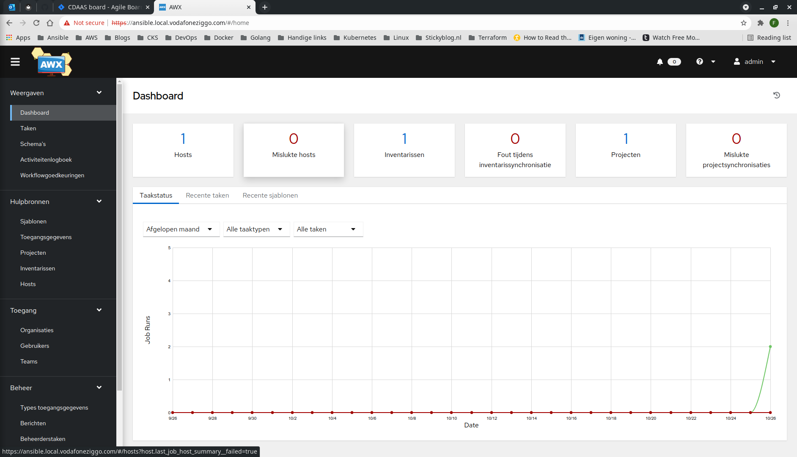

# AWX
This document describes how to provision AWX on a Vagrant Kubernetes cluster using the AWX operator.
## Step-by-step
1. SSH into the master node and check cluster availability.
```bash
$ vagrant ssh k8s-m-1
Welcome to Ubuntu 20.04.2 LTS (GNU/Linux 5.4.0-80-generic x86_64)

 * Documentation:  https://help.ubuntu.com
 * Management:     https://landscape.canonical.com
 * Support:        https://ubuntu.com/advantage

  System information as of Tue 26 Oct 2021 05:42:08 PM UTC

  System load:  0.95              Users logged in:        0
  Usage of /:   6.5% of 61.31GB   IPv4 address for eth0:  10.0.2.15
  Memory usage: 43%               IPv4 address for eth1:  192.168.50.11
  Swap usage:   0%                IPv4 address for tunl0: 192.168.116.0
  Processes:    161


This system is built by the Bento project by Chef Software
More information can be found at https://github.com/chef/bento
Last login: Tue Oct 26 17:39:01 2021 from 10.0.2.2
```
2. Clone the AWX operator repository.
```bash
vagrant@k8s-m-1:~$ git clone https://github.com/ansible/awx-operator.git
Cloning into 'awx-operator'...
remote: Enumerating objects: 5783, done.
remote: Counting objects: 100% (2792/2792), done.
remote: Compressing objects: 100% (1031/1031), done.
remote: Total 5783 (delta 1876), reused 2424 (delta 1659), pack-reused 2991
Receiving objects: 100% (5783/5783), 1.42 MiB | 5.54 MiB/s, done.
Resolving deltas: 100% (3301/3301), done.
```
3. Move into AWX operator working directory.
```bash
vagrant@k8s-m-1:~$ cd awx-operator/
vagrant@k8s-m-1:~/awx-operator$
```
4. Inspect AWX operator version tags.
```bash
vagrant@k8s-m-1:~/awx-operator$ git tag -l
0.10.0
0.11.0
0.12.0
0.13.0
0.14.0
0.6.0
0.7.0
0.8.0
0.9.0
```
5. Checkout AWX operator version tag.
```bash
vagrant@k8s-m-1:~/awx-operator$ git checkout tags/0.14.0 -b tags/0.14.0
Switched to a new branch 'tags/0.14.0'
```
6. Run AWX operator make-file.
```bash
vagrant@k8s-m-1:~/awx-operator$ make deploy
cd config/manager && /home/vagrant/awx-operator/bin/kustomize edit set image controller=quay.io/ansible/awx-operator:0.14.0
cd config/default && /home/vagrant/awx-operator/bin/kustomize edit set namespace awx
/home/vagrant/awx-operator/bin/kustomize build config/default | kubectl apply -f -
namespace/awx created
customresourcedefinition.apiextensions.k8s.io/awxbackups.awx.ansible.com created
customresourcedefinition.apiextensions.k8s.io/awxrestores.awx.ansible.com created
customresourcedefinition.apiextensions.k8s.io/awxs.awx.ansible.com created
serviceaccount/awx-operator-controller-manager created
role.rbac.authorization.k8s.io/awx-operator-leader-election-role created
role.rbac.authorization.k8s.io/awx-operator-manager-role created
clusterrole.rbac.authorization.k8s.io/awx-operator-metrics-reader created
clusterrole.rbac.authorization.k8s.io/awx-operator-proxy-role created
rolebinding.rbac.authorization.k8s.io/awx-operator-leader-election-rolebinding created
rolebinding.rbac.authorization.k8s.io/awx-operator-manager-rolebinding created
clusterrolebinding.rbac.authorization.k8s.io/awx-operator-proxy-rolebinding created
configmap/awx-operator-manager-config created
service/awx-operator-controller-manager-metrics-service created
deployment.apps/awx-operator-controller-manager created
```
7. Inspect awx-operator-controller-manager for readiness.
```bash
vagrant@k8s-m-1:~/awx-operator$ kubectl get deploy -n awx -w
NAME                              READY   UP-TO-DATE   AVAILABLE   AGE
awx-operator-controller-manager   0/1     1            0           15s
awx-operator-controller-manager   1/1     1            1           50s
```
8. There is a possibility the internal postgres ```pod``` will stay pending because there is no ```PersistentVolume``` to be claimed. In this case, create the following ```PersistentVolume``` and deploy it to awx ```namespace```.
```yaml
apiVersion: v1
kind: PersistentVolume
metadata:
  name: pv-postgres-01
spec:
  accessModes:
  - ReadWriteOnce
  capacity:
    storage: 8Gi
  claimRef:
    apiVersion: v1
    kind: PersistentVolumeClaim
    name: postgres-awx-demo-postgres-0
    namespace: awx
  hostPath:
    path: /var/local-path-provisioner/pvc-17da7249-d9c9-4f27-8f88-68c526eb287a_awx_postgres-awx-demo-postgres-0
    type: DirectoryOrCreate
  persistentVolumeReclaimPolicy: Delete
  storageClassName: standard
  volumeMode: Filesystem
```
9. Deploy ```PersistentVolume```.
```bash
vagrant@k8s-m-1:~/awx-operator$ kubectl apply -f pv.yaml 
persistentvolume/pv-postgres-01 created
```
10. Edit ```awx-demo.yaml```.
```yaml
---
apiVersion: awx.ansible.com/v1beta1
kind: AWX
metadata:
  name: awx-demo
spec:
  service_type: ClusterIP
  ingress_type: ingress
  ingress_annotations: |
    kubernetes.io/ingress.class: "nginx"
  hostname: ansible.local.vodafoneziggo.com
```
11. Deploy AWX.
```bash
vagrant@k8s-m-1:~/awx-operator$ kubectl apply -f awx-demo.yml -n awx
awx.awx.ansible.com/awx-demo created
```
12. Inspect AWX pods for readiness.
After some minutes.
```bash
vagrant@k8s-m-1:~/awx-operator$ kubectl get po -n awx -w
NAME                                               READY   STATUS              RESTARTS   AGE
awx-demo-d46576-gq6g9                              0/4     ContainerCreating   0          114s
awx-demo-postgres-0                                1/1     Running             0          2m2s
awx-operator-controller-manager-68d787cfbd-mb5d9   2/2     Running             0          4m43s
awx-demo-d46576-gq6g9                              4/4     Running             0          2m35s
```
13. Fetch admin credentials.
```bash
vagrant@k8s-m-1:~/awx-operator$ kubectl get secret awx-demo-admin-password -o jsonpath="{.data.password}" -n awx | base64 --decode
I3UHCkULobfnZQNpqAgiF19xQIAxq1TN
```
14. Exit the master node.
```bash
vagrant@k8s-m-1:~/awx-operator$ exit
logout
Connection to 127.0.0.1 closed.
```
15. Create custom DNS entry on localhost. The IP address is that of the Nginx ingress controller.
```bash
$ sudo bash -c "echo '192.168.50.240 ansible.local.vodafoneziggo.com' >> /etc/hosts"
[sudo] password for fforoozan:
```
16. Access the AWX web server using the custom domain name and log-in using admin credentials.
)