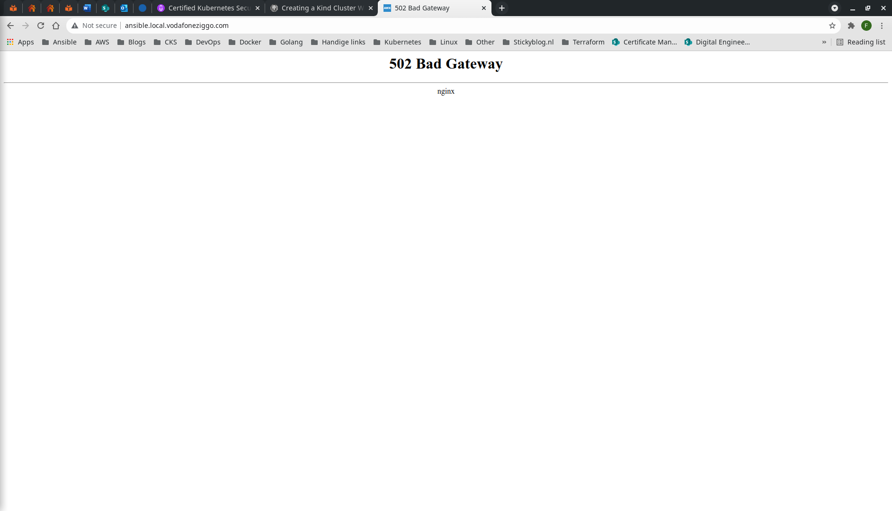

# AWX
This document describes how to provision AWX on a Kind Kubernetes cluster using the [AWX operator](https://github.com/ansible/awx-operator).
## Step-by-step
1. Execute the following command.
```bash
$ make awx
```
2. Access the AWX web server using the custom domain name and log in using ```admin``` credentials.

3. HTTP 502 Bad Gateway means AWX is still installing. Give it a couple minutes.
