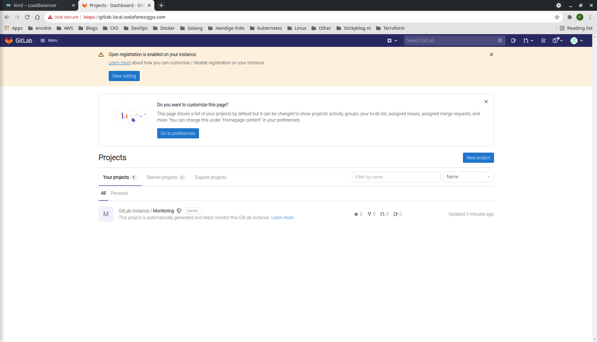

# GITLAB
This document describes how to provision GitLab on a Kind Kubernetes cluster following the [official documentation](https://docs.gitlab.com/charts/installation/deployment.html).
## Prerequisites
* [Helm 3](https://helm.sh/docs/intro/install/)
## Step-by-step
1. Create GitLab ```namespace```.
```bash
$ kubectl create ns gitlab
namespace/gitlab created
```
2. Add GitLab Helm chart repository.
```bash
$ helm repo add gitlab https://charts.gitlab.io/
$ helm repo update
```
3. Install GitLab Helm chart.
```bash
helm install gitlab gitlab/gitlab \
  --timeout 600s \
  --set global.hosts.domain=local.vodafoneziggo.com \
  --set certmanager.install=false \
  --set global.ingress.configureCertmanager=false \
  --set gitlab-runner.install=false \
  --namespace=gitlab
```
4. Inspect GitLab pods for readiness. This takes 10 minutes, give or take.
```bash
$ k get po -n gitlab -w
NAME                                                    READY   STATUS             RESTARTS   AGE
gitlab-gitaly-0                                         0/1     ImagePullBackOff   0          11m
gitlab-gitlab-exporter-7448bd7468-j7kdd                 1/1     Running            0          11m
gitlab-gitlab-shell-7fbc599c7d-5kh47                    1/1     Running            0          11m
gitlab-gitlab-shell-7fbc599c7d-wjblv                    1/1     Running            0          11m
gitlab-migrations-1-4khbq                               0/1     Completed          3          11m
gitlab-minio-864888b9fb-x8c45                           1/1     Running            0          11m
gitlab-minio-create-buckets-1-hlg7l                     0/1     Completed          0          11m
gitlab-nginx-ingress-controller-7bd98f4bc7-kjn8g        1/1     Running            0          11m
gitlab-nginx-ingress-controller-7bd98f4bc7-x7p4x        1/1     Running            0          11m
gitlab-nginx-ingress-default-backend-79f8bd4776-g5jjd   1/1     Running            0          11m
gitlab-postgresql-0                                     2/2     Running            0          11m
gitlab-prometheus-server-6444c7bd76-vzfrn               2/2     Running            0          11m
gitlab-redis-master-0                                   2/2     Running            0          11m
gitlab-registry-5f6bcb6644-skx2q                        1/1     Running            0          11m
gitlab-registry-5f6bcb6644-z576v                        1/1     Running            0          11m
gitlab-sidekiq-all-in-1-v1-558ddbf97f-v4vtb             1/1     Running            0          11m
gitlab-task-runner-57f78fd8f7-hccfl                     1/1     Running            0          11m
gitlab-webservice-default-7f446dfc4c-26mp8              2/2     Running            0          11m
gitlab-webservice-default-7f446dfc4c-msnwv              2/2     Running            0          11m
```
5. Fetch ```root``` credentials.
```bash
$ kubectl get secret gitlab-gitlab-initial-root-password -ojsonpath='{.data.password}' -n gitlab | base64 --decode; echo
1hqf55X2VvoSRmTQo5YEboyIXIZCnUNWFaC5WYL954axAuoxU3iK3gCOSiKtsdeP
```
6. Fetch IP of ```Nginx Ingress Controller``` service.
```bash
$ kubectl get svc gitlab-nginx-ingress-controller -n gitlab -o jsonpath='{.status.loadBalancer.ingress[0].ip}'; echo
172.18.255.201
```
7. Create custom DNS entry. The IP address is that of the ```Nginx Ingress Controller```.
```bash
$ sudo bash -c "echo '172.18.255.201 gitlab.local.vodafoneziggo.com' >> /etc/hosts"
```
8. Access the GitLab web server using the custom domain name and log in using ```root``` credentials.
