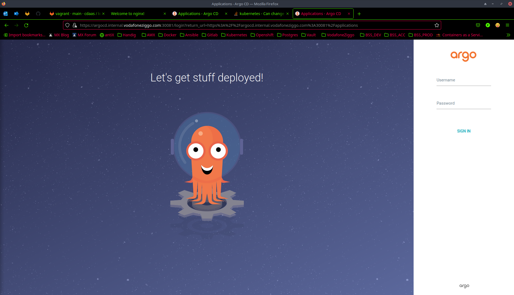
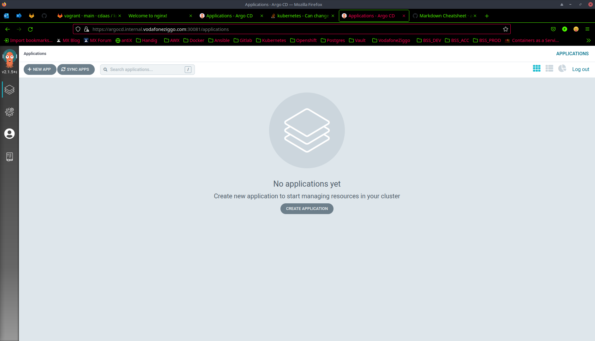

# ArgoCD
## Prerequisites
* [Argocd CLI](https://argo-cd.readthedocs.io/en/stable/cli_installation/)

## Step-by-step
1. Create ```argocd``` namespace.
```bash
vagrant@k8s-master:~$ kubectl create ns argocd
namespace/argocd created
```
2. Deploy ArgoCD manifest.
```bash
vagrant@k8s-master:~$ kubectl apply -n argocd -f https://raw.githubusercontent.com/argoproj/argo-cd/stable/manifests/install.yaml
```
3. Edit existing ```argocd-server``` service and expose it on unique NodePort instead of ClusterIP. Look for the ```type:```-field and change its value to NodePort.
```bash
vagrant@k8s-master:~$ kubectl edit svc -n argocd argocd-server
service/argocd-server edited
```
4. Inspect ```argocd-server``` service type to be NodePort.
```bash
vagrant@k8s-master:~$ kubectl describe svc -n argocd argocd-server | grep -i type
Type:                     NodePort
```
5. Patch ```argocd-server``` service to unique NodePort 30081.
```bash
vagrant@k8s-master:~$ kubectl patch svc argocd-server -n argocd -p '{"spec": {"ports": [{"name": "https", "port": 443, "type": "NodePort", "nodePort": 30081}]}}'
service/argocd-server patched
```
6. Fetch ArgoCD initial admin credentials.
```bash
vagrant@k8s-master:~$ kubectl -n argocd get secret argocd-initial-admin-secret -o jsonpath="{.data.password}" | base64 -d
fFcBJGPTjhqhSVwi
```
7. Create custom DNS entry on localhost using Ingress' external IP.
```bash
$ sudo bash -c "echo '192.168.50.10 argocd.internal.vodafoneziggo.com' >> /etc/hosts"
```
8. Access ArgoCD via webbrowser http://argocd.internal.vodafoneziggo.com:30081. And log-in using admin credentials.


