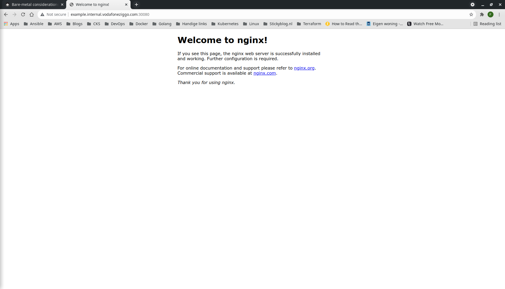

# Vagrant

Vagrant allows for provisioning of multi-node clusters on virtual machines using VirtualBox. The advantage of using traditional VMs is that it represents a production-like environment more closely and it allows users to install custom command-line tools. The downside of using a Vagrant cluster is that it takes longer to setup and requires higher resources from the host machine. 

## Prerequisites
* VirtualBox
* Ansible

## Step-by-step
1. Bringing up the Vagrant cluster is as simple as running a command. Vagrant will bootstrap the nodes using Ansible playbooks in the ```kubernetes-setup``` directory. The worker nodes will be automatically joined to the master node.
```bash
$ vagrant up
Bringing machine 'k8s-master' up with 'virtualbox' provider...
Bringing machine 'k8s-worker-1' up with 'virtualbox' provider...
Bringing machine 'k8s-worker-2' up with 'virtualbox' provider...
```
2. SSH into the master node and check cluster availability.
```bash
$ vagrant ssh k8s-master
Welcome to Ubuntu 18.04.5 LTS (GNU/Linux 4.15.0-151-generic x86_64)

 * Documentation:  https://help.ubuntu.com
 * Management:     https://landscape.canonical.com
 * Support:        https://ubuntu.com/advantage

  System information as of Sun Oct 24 12:42:15 UTC 2021

  System load:  0.27              Users logged in:      0
  Usage of /:   6.2% of 61.80GB   IP address for eth0:  10.0.2.15
  Memory usage: 23%               IP address for eth1:  192.168.50.10
  Swap usage:   0%                IP address for tunl0: 172.16.235.192
  Processes:    154


This system is built by the Bento project by Chef Software
More information can be found at https://github.com/chef/bento
Last login: Sun Oct 24 12:38:25 2021 from 10.0.2.2
```
```bash
vagrant@k8s-master:~$ kubectl cluster-info --context kubernetes-admin@kubernetes
Kubernetes control plane is running at https://192.168.50.10:6443
CoreDNS is running at https://192.168.50.10:6443/api/v1/namespaces/kube-system/services/kube-dns:dns/proxy

To further debug and diagnose cluster problems, use 'kubectl cluster-info dump'.
```
3. Inspect worker node availability.
```bash
vagrant@k8s-master:~$ kubectl get no 
NAME           STATUS   ROLES                  AGE     VERSION
k8s-master     Ready    control-plane,master   10m     v1.22.0
k8s-worker-1   Ready    <none>                 8m50s   v1.22.0
k8s-worker-2   Ready    <none>                 7m21s   v1.22.0
```
## How to spin up a Kubernetes service
1. For example, we'll run NGINX web server.
```bash
vagrant@k8s-master:~$ kubectl create ns example
namespace/example created
vagrant@k8s-master:~$ kubectl run nginx --image=nginx --namespace=example
pod/nginx created
```
2. On bare-metal environments, it's sufficient to expose services on NodePorts. For exposing services via Ingress, read the following article: https://kubernetes.github.io/ingress-nginx/deploy/baremetal/. We expose the pod on NodePort 30080.
```bash
vagrant@k8s-master:~$ kubectl expose po nginx --namespace=example --port=80 --name=nginx --type=NodePort
service/nginx exposed
vagrant@k8s-master:~$ kubectl patch svc nginx --namespace=example -p '{"spec": {"ports": [{"name": "nginx", "port": 80, "nodePort": 30080}]}}'
service/nginx patched
```
6. Exit k8s-master.
```bash
vagrant@k8s-master:~$ exit
logout
Connection to 127.0.0.1 closed.
```
7. Create custom DNS entry on localhost. The IP address can be any of the nodes.
```bash
$ sudo bash -c "echo '192.168.50.10 example.internal.vodafoneziggo.com' >> /etc/hosts"
```
8. Access the Nginx web server using the custom domain name and exposed port.
