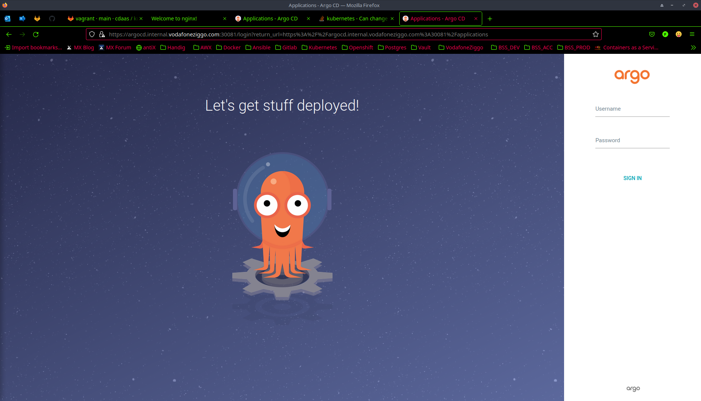
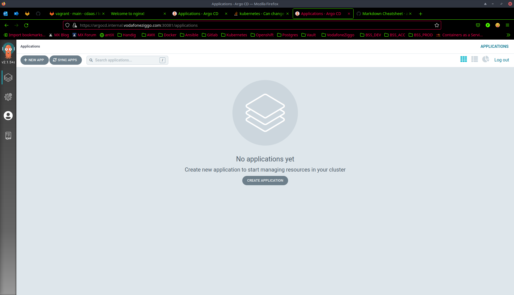

# ArgoCD
This document describes how to provision ArgoCD on a Vagrant Kubernetes cluster following the [official documentation](https://argo-cd.readthedocs.io/en/stable/getting_started/).
## Prerequisites
* [Argocd CLI](https://argo-cd.readthedocs.io/en/stable/cli_installation/)

## Step-by-step
1. SSH into the master node.
```bash
$ vagrant ssh k8s-master
Welcome to Ubuntu 18.04.5 LTS (GNU/Linux 4.15.0-151-generic x86_64)

 * Documentation:  https://help.ubuntu.com
 * Management:     https://landscape.canonical.com
 * Support:        https://ubuntu.com/advantage

  System information as of Sun Oct 24 18:59:20 UTC 2021

  System load:  0.09              Users logged in:      0
  Usage of /:   6.1% of 61.80GB   IP address for eth0:  10.0.2.15
  Memory usage: 12%               IP address for eth1:  192.168.50.10
  Swap usage:   0%                IP address for tunl0: 172.16.235.192
  Processes:    158


This system is built by the Bento project by Chef Software
More information can be found at https://github.com/chef/bento
Last login: Sun Oct 24 18:46:51 2021 from 10.0.2.2
```
2. Create ```argocd``` namespace.
```bash
vagrant@k8s-master:~$ kubectl create ns argocd
namespace/argocd created
```
3. Deploy ArgoCD manifest.
```bash
vagrant@k8s-master:~$ kubectl apply -n argocd -f https://raw.githubusercontent.com/argoproj/argo-cd/stable/manifests/install.yaml
customresourcedefinition.apiextensions.k8s.io/applications.argoproj.io created
customresourcedefinition.apiextensions.k8s.io/appprojects.argoproj.io created
serviceaccount/argocd-application-controller created
serviceaccount/argocd-dex-server created
serviceaccount/argocd-redis created
serviceaccount/argocd-server created
role.rbac.authorization.k8s.io/argocd-application-controller created
role.rbac.authorization.k8s.io/argocd-dex-server created
role.rbac.authorization.k8s.io/argocd-server created
clusterrole.rbac.authorization.k8s.io/argocd-application-controller created
clusterrole.rbac.authorization.k8s.io/argocd-server created
rolebinding.rbac.authorization.k8s.io/argocd-application-controller created
rolebinding.rbac.authorization.k8s.io/argocd-dex-server created
rolebinding.rbac.authorization.k8s.io/argocd-redis created
rolebinding.rbac.authorization.k8s.io/argocd-server created
clusterrolebinding.rbac.authorization.k8s.io/argocd-application-controller created
clusterrolebinding.rbac.authorization.k8s.io/argocd-server created
configmap/argocd-cm created
configmap/argocd-cmd-params-cm created
configmap/argocd-gpg-keys-cm created
configmap/argocd-rbac-cm created
configmap/argocd-ssh-known-hosts-cm created
configmap/argocd-tls-certs-cm created
secret/argocd-secret created
service/argocd-dex-server created
service/argocd-metrics created
service/argocd-redis created
service/argocd-repo-server created
service/argocd-server created
service/argocd-server-metrics created
deployment.apps/argocd-dex-server created
deployment.apps/argocd-redis created
deployment.apps/argocd-repo-server created
deployment.apps/argocd-server created
statefulset.apps/argocd-application-controller created
networkpolicy.networking.k8s.io/argocd-application-controller-network-policy created
networkpolicy.networking.k8s.io/argocd-dex-server-network-policy created
networkpolicy.networking.k8s.io/argocd-redis-network-policy created
networkpolicy.networking.k8s.io/argocd-repo-server-network-policy created
networkpolicy.networking.k8s.io/argocd-server-network-policy created
```
4. Edit existing ```argocd-server``` service and expose it on unique NodePort instead of ClusterIP. Look for the ```type:``` field and change its value to NodePort instead of ClusterIP.
```bash
vagrant@k8s-master:~$ kubectl edit svc -n argocd argocd-server
service/argocd-server edited
```
5. Inspect ```argocd-server``` service type to be NodePort.
```bash
vagrant@k8s-master:~$ kubectl get svc -n argocd argocd-server -o yaml | grep -i type
  type: NodePort
```
6. Patch ```argocd-server``` service to unique NodePort 30081.
```bash
vagrant@k8s-master:~$ kubectl patch svc argocd-server -n argocd -p '{"spec": {"ports": [{"name": "https", "port": 443, "type": "NodePort", "nodePort": 30081}]}}'
service/argocd-server patched
```
6. Fetch ArgoCD initial admin credentials.
```bash
vagrant@k8s-master:~$ kubectl -n argocd get secret argocd-initial-admin-secret -o jsonpath="{.data.password}" | base64 -d
fFcBJGPTjhqhSVwi
```
7. Exit master node.
```bash
vagrant@k8s-master:~$ exit
logout
Connection to 127.0.0.1 closed.
```
8. Create custom DNS entry on localhost. The IP address can be any of the nodes.
```bash
$ sudo bash -c "echo '192.168.50.10 argocd.internal.vodafoneziggo.com' >> /etc/hosts"
```
8. Access ArgoCD via webbrowser http://argocd.internal.vodafoneziggo.com:30081. And log-in using admin credentials.


