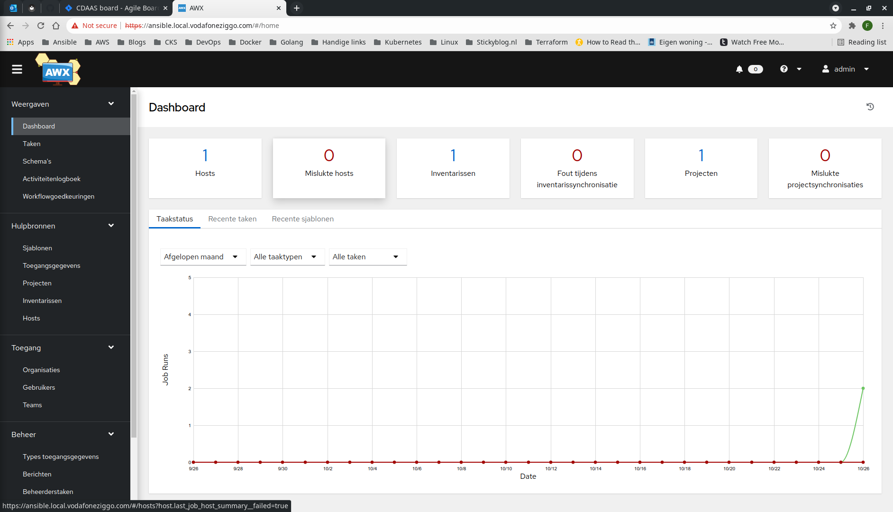
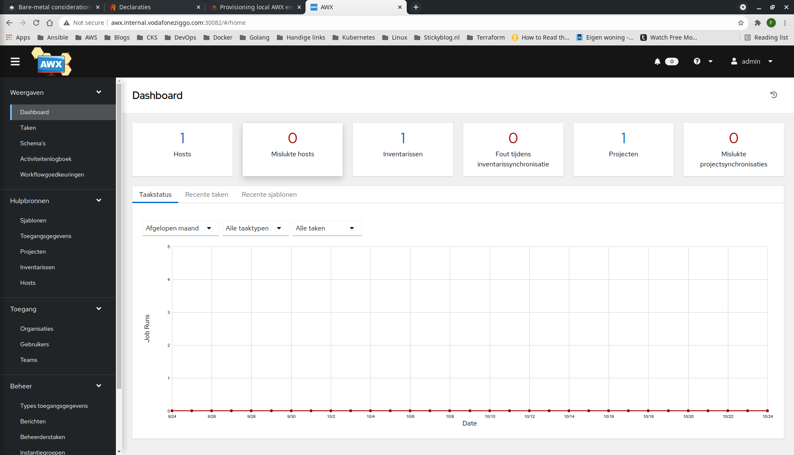

# AWX
This document describes how to provision AWX on a Vagrant Kubernetes cluster using the AWX operator.
## Step-by-step
1. SSH into the master node.
```bash
$ vagrant ssh k8s-master
Welcome to Ubuntu 18.04.5 LTS (GNU/Linux 4.15.0-151-generic x86_64)

 * Documentation:  https://help.ubuntu.com
 * Management:     https://landscape.canonical.com
 * Support:        https://ubuntu.com/advantage

  System information as of Sun Oct 24 18:32:47 UTC 2021

  System load:  1.26              Users logged in:      0
  Usage of /:   6.0% of 61.80GB   IP address for eth0:  10.0.2.15
  Memory usage: 12%               IP address for eth1:  192.168.50.10
  Swap usage:   0%                IP address for tunl0: 172.16.235.192
  Processes:    167


This system is built by the Bento project by Chef Software
More information can be found at https://github.com/chef/bento
Last login: Sun Oct 24 18:29:57 2021 from 10.0.2.2
```
2. Clone the AWX operator repository.
```bash
vagrant@k8s-master:~$ git clone https://github.com/ansible/awx-operator.git
Cloning into 'awx-operator'...
remote: Enumerating objects: 5735, done.
remote: Counting objects: 100% (2833/2833), done.
remote: Compressing objects: 100% (1046/1046), done.
remote: Total 5735 (delta 1908), reused 2436 (delta 1685), pack-reused 2902
Receiving objects: 100% (5735/5735), 1.41 MiB | 4.21 MiB/s, done.
Resolving deltas: 100% (3264/3264), done.
```
3. Move into AWX operator working directory.
```bash
vagrant@k8s-master:~$ cd awx-operator/
vagrant@k8s-master:~/awx-operator$
```
4. Inspect AWX operator version tags.
```bash
vagrant@k8s-master:~/awx-operator$ git tag -l
0.10.0
0.11.0
0.12.0
0.13.0
0.14.0
0.6.0
0.7.0
0.8.0
0.9.0
```
5. Checkout AWX operator version tag.
```bash
vagrant@k8s-master:~/awx-operator$ git checkout tags/0.14.0 -b tags/0.14.0
Switched to a new branch 'tags/0.14.0'
```
6. Run AWX operator make-file.
```bash
vagrant@k8s-master:~/awx-operator$ make deploy
cd config/manager && /home/vagrant/awx-operator/bin/kustomize edit set image controller=quay.io/ansible/awx-operator:0.14.0
cd config/default && /home/vagrant/awx-operator/bin/kustomize edit set namespace awx
/home/vagrant/awx-operator/bin/kustomize build config/default | kubectl apply -f -
namespace/awx created
customresourcedefinition.apiextensions.k8s.io/awxbackups.awx.ansible.com created
customresourcedefinition.apiextensions.k8s.io/awxrestores.awx.ansible.com created
customresourcedefinition.apiextensions.k8s.io/awxs.awx.ansible.com created
serviceaccount/awx-operator-controller-manager created
role.rbac.authorization.k8s.io/awx-operator-leader-election-role created
role.rbac.authorization.k8s.io/awx-operator-manager-role created
clusterrole.rbac.authorization.k8s.io/awx-operator-metrics-reader created
clusterrole.rbac.authorization.k8s.io/awx-operator-proxy-role created
rolebinding.rbac.authorization.k8s.io/awx-operator-leader-election-rolebinding created
rolebinding.rbac.authorization.k8s.io/awx-operator-manager-rolebinding created
clusterrolebinding.rbac.authorization.k8s.io/awx-operator-proxy-rolebinding created
configmap/awx-operator-manager-config created
service/awx-operator-controller-manager-metrics-service created
deployment.apps/awx-operator-controller-manager created
```
7. Inspect ```awx-operator-controller-manager``` for readiness.
```bash
vagrant@k8s-master:~/awx-operator$ kubectl get deploy -n awx -w
NAME                              READY   UP-TO-DATE   AVAILABLE   AGE
awx-operator-controller-manager   0/1     1            0           34s
awx-operator-controller-manager   1/1     1            1           60s
```
8. Deploy AWX.
```bash
vagrant@k8s-master:~/awx-operator$ kubectl apply -f awx-demo.yml -n awx
awx.awx.ansible.com/awx-demo created
```
9. Inspect AWX pods for readiness.
```bash
vagrant@k8s-master:~/awx-operator$ kubectl get po -n awx
NAME                                               READY   STATUS              RESTARTS   AGE
awx-demo-d46576-mwq8f                              0/4     ContainerCreating   0          22s
awx-demo-postgres-0                                0/1     Pending             0          29s
awx-operator-controller-manager-68d787cfbd-qn9gh   2/2     Running             0          2m35s
```
10. There is a possibility the Postgres pod will stay pending because there is no PersistentVolume to be claimed. In this case, create the following PersistentVolume and deploy it to ```awx``` namespace.
```yaml
apiVersion: v1
kind: PersistentVolume
metadata:
  name: pv-postgres-01
spec:
  accessModes:
  - ReadWriteOnce
  capacity:
    storage: 8Gi
  claimRef:
    apiVersion: v1
    kind: PersistentVolumeClaim
    name: postgres-awx-demo-postgres-0
    namespace: awx
  hostPath:
    path: /var/local-path-provisioner/pvc-17da7249-d9c9-4f27-8f88-68c526eb287a_awx_postgres-awx-demo-postgres-0
    type: DirectoryOrCreate
  persistentVolumeReclaimPolicy: Delete
  storageClassName: standard
  volumeMode: Filesystem
```
```bash
vagrant@k8s-master:~/awx-operator$ kubectl apply -f pv.yaml 
persistentvolume/pv-postgres-01 created
```
11. Inspect the new PersistentVolume to be bound.
```bash
vagrant@k8s-master:~/awx-operator$ kubectl get pvc -n awx
NAME                           STATUS   VOLUME           CAPACITY   ACCESS MODES   STORAGECLASS   AGE
postgres-awx-demo-postgres-0   Bound    pv-postgres-01   8Gi        RWO                           2m53s
```
12. Inspect the Postgres pod status to be ContainerCreating. It will take some time to be up and running.
```bash
vagrant@k8s-master:~/awx-operator$ kubectl get po -n awx -w
NAME                                               READY   STATUS              RESTARTS   AGE
awx-demo-d46576-mwq8f                              4/4     Running             0          3m23s
awx-demo-postgres-0                                0/1     ContainerCreating   0          3m30s
awx-operator-controller-manager-68d787cfbd-qn9gh   2/2     Running             0          5m36s
```
After some minutes.
```bash
vagrant@k8s-master:~$ kubectl get po -n awx
NAME                                               READY   STATUS    RESTARTS   AGE
awx-demo-d46576-mwq8f                              4/4     Running   0          8m33s
awx-demo-postgres-0                                1/1     Running   0          8m40s
awx-operator-controller-manager-68d787cfbd-qn9gh   2/2     Running   0          10m
```
13. Patch the ```awx-demo-service``` to unique NodePort 30082. 
```bash
vagrant@k8s-master:~/awx-operator$ kubectl patch svc awx-demo-service -n awx -p '{"spec": {"ports": [{"name": "http", "port": 80, "nodePort": 30082}]}}'
service/awx-demo-service patched
```
14. Fetch admin credentials.
```bash
vagrant@k8s-master:~$ kubectl get secret awx-demo-admin-password -o jsonpath="{.data.password}" -n awx | base64 --decode
PLxgtXkBLBATV0JIClgcnLyPXp0Qc0wr
```
15. Exit the master node.
```bash
vagrant@k8s-master:~/awx-operator$ exit
logout
Connection to 127.0.0.1 closed.
```
16. Create custom DNS entry on localhost. The IP address can be any of the nodes.
```bash
$ sudo bash -c "echo '192.168.50.10 awx.internal.vodafoneziggo.com' >> /etc/hosts"
[sudo] password for fforoozan:
```
17. Access the AWX web server using the custom domain name and exposed port.

18. Log-in using the admin credentials.
